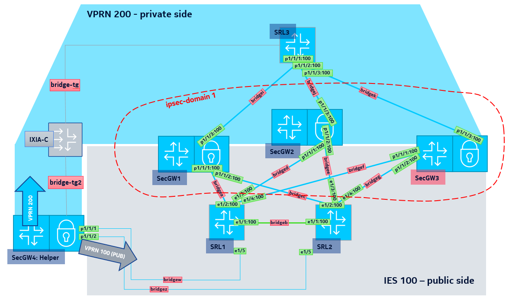

# Security Gateway Lab based on Nokia SR-OS and Nokia SRL

what's a __SeGW__ is defined by 3GPP within the TS 33.210 specification. 

_"The border between the security domains is protected by Security Gateways (SEGs).The SEGs are responsible for enforcing the security policy of a security domain towards other SEGs in the destination security domain."_ In essence, it's the IPSec termination point for the secured RAN traffic. 

## Lab info 

1. Runs on [Containerlab](https://github.com/srl-labs/containerlab) 
2. It heavily uses linux bridges for connectivity between containers so please set them up accordingly.  
3. Releases: SR-OS 22.10.R1 and SRL 22.6.4  
4. [IXIA-C-One](https://github.com/orgs/open-traffic-generator/packages/container/package/ixia-c-one) is also used to generate GTP traffic and send it across the SeGW cluster 
5. OTG API's allows for generate any kind of traffic with [snappi](https://github.com/open-traffic-generator/snappi), here GTPv1 is modeled to simulate typical RAN traffic.
6. Main purpose of the lab is for the network operators to be familair with new MC-IPsec N:M functionality 
7. N:M allows for the deployment of SeGW clusters, while offering full stateful redundancy for thousands of IPSec tunnels. 

A diagram of the setup is shown here: 

## detailed instructions will follow. 
