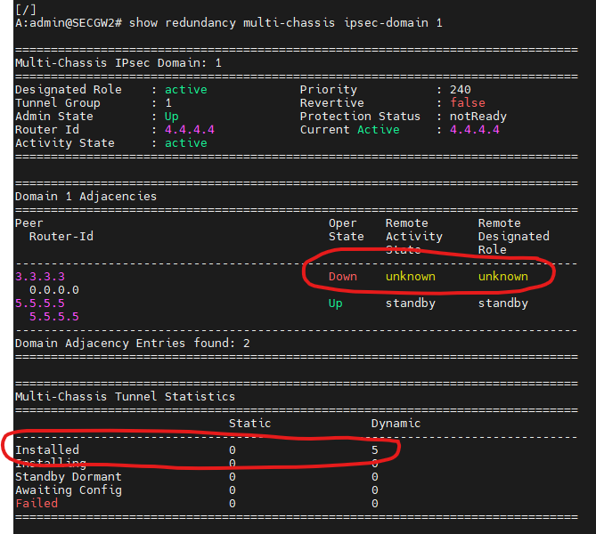
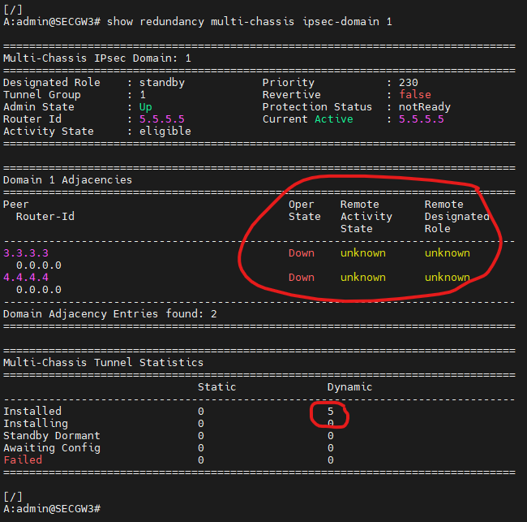
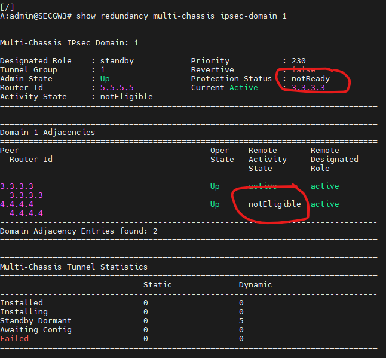

# Security Gateway Lab based on Nokia SR-OS and Nokia SRL

what's a __SeGW__ is defined by 3GPP within the TS 33.210 specification.

_"The border between the security domains is protected by Security Gateways (SEGs).The SEGs are responsible for enforcing the security policy of a security domain towards other SEGs in the destination security domain."_

In essence, SeGW is the IPSec termination point for the secured RAN traffic on 4G and 5G networks.  

## Lab info

1. Runs on [Containerlab](https://github.com/srl-labs/containerlab)
2. It heavily uses Linux bridges for connectivity between containers so please set them up accordingly.  
3. Releases: SR-OS 22.10.R1 and SRL 22.6.4  
4. [IXIA-C-One](https://github.com/orgs/open-traffic-generator/packages/container/package/ixia-c-one) is also used to generate GTP traffic and send it across the SeGW cluster
5. OTG API's allows for generate any kind of traffic with [snappi](https://github.com/open-traffic-generator/snappi), here GTPv1 is modeled to simulate typical RAN traffic.
6. Main purpose of the lab is for the network operators to be familiar with new MC-IPsec N:M functionality
7. N:M allows for the deployment of SeGW clusters, while offering full stateful redundancy for thousands of IPSec tunnels.

A diagram of the setup is shown here:


### General setup

Setup is made out of few nodes :
- 3 Nokia SR-OS nodes, sros1-2 and 3, which are making up the SeGW cluster  
- 1 Nokia SR-OS node, sros4, used to establish tunnels
- 2 Nokia SRL nodes, srl1-2, required to emulate an access network (public side, encrypted)
- 1 Nokia SRL node, srl3, required to emulate the core network (private side, clear-text)
- 1 IXIA-C container node which provides for traffic generation to/from the core network to/from the access network

### Deploying the lab

Just run `clab deploy` in the working directory to startup the lab.
To stop the lab, `clab destroy`.

Startup takes some time depending on the hardware resources you have. SROS nodes startup is delayed too, to make it run smoother, feel free to edit the clab yml file based on your deployment scenario. When it's ready you should see something as:  

```
+---+--------------------------+--------------+------------------------------------------------------+---------------------+---------+----------------+----------------------+
| # |           Name           | Container ID |                        Image                         |        Kind         |  State  |  IPv4 Address  |     IPv6 Address     |
+---+--------------------------+--------------+------------------------------------------------------+---------------------+---------+----------------+----------------------+
| 1 | clab-segw-sros-01-ixia-c | c5706b2d0721 | ghcr.io/open-traffic-generator/ixia-c-one:0.0.1-3423 | keysight_ixia-c-one | running | 172.20.20.4/24 | 2001:172:20:20::4/64 |
| 2 | clab-segw-sros-01-srl1   | 763c7b8f5fb4 | ghcr.io/nokia/srlinux                                | srl                 | running | 172.20.20.7/24 | 2001:172:20:20::7/64 |
| 3 | clab-segw-sros-01-srl2   | 3f1f95ef1f4c | ghcr.io/nokia/srlinux                                | srl                 | running | 172.20.20.2/24 | 2001:172:20:20::2/64 |
| 4 | clab-segw-sros-01-srl3   | d03dd26e4e56 | ghcr.io/nokia/srlinux                                | srl                 | running | 172.20.20.8/24 | 2001:172:20:20::8/64 |
| 5 | clab-segw-sros-01-sros1  | 1fcb4e9d4f00 | vrnetlab/vr-sros:22.10.R1                            | vr-sros             | running | 172.20.20.9/24 | 2001:172:20:20::9/64 |
| 6 | clab-segw-sros-01-sros2  | 00e2d21680a7 | vrnetlab/vr-sros:22.10.R1                            | vr-sros             | running | 172.20.20.6/24 | 2001:172:20:20::6/64 |
| 7 | clab-segw-sros-01-sros3  | 2c3f1de6d76a | vrnetlab/vr-sros:22.10.R1                            | vr-sros             | running | 172.20.20.5/24 | 2001:172:20:20::5/64 |
| 8 | clab-segw-sros-01-sros4  | 9b327f51a6bd | vrnetlab/vr-sros:22.10.R1                            | vr-sros             | running | 172.20.20.3/24 | 2001:172:20:20::3/64 |
+---+--------------------------+--------------+------------------------------------------------------+---------------------+---------+----------------+----------------------+
```

### Accessing the network elements

Containerlab provides for /etc/hosts configuration, so nodes can normally be accessed with `ssh -l admin clab-segw-sros-01-sros4` admin/admin is the default configured password for all the nodes.

### Configuration

For all the nodes, SR-OS and SRL configuration is already provided at startup. SR-OS nodes are configured in "mixed mode" to allow usage of both classic-cli and md-cli.

#### Configuration details

**L2** connectivity is built with bridges, this allows for usage of dot1q interfaces across all the nodes.
**IP underlay** is made with OSPF, while L3-VPN services (VPRN) are connected by direct links (tagged VLANs) in the proper configuration context.

For the details how node IGP's and routing, please have a look to configurations under the configs folder. Please note: there could some configuration items which are unnecessary or partially done in some nodes (QoS, netconf...)

#### SeGW cluster

As said above, the main purpose of this lab is to play with a new feature available in SR-OS, hereafter called N:M or N2M.
N2M allows for the setup of a SeGW ipsec-domain, this is defined under the context `[gl:/configure redundancy multi-chassis]`, here all the peering nodes participating to ipsec-domain are configured and declared, roles, priority and bfd (optional) parameters must be defined here.

For the details on both routing and service configurations, please refer to official Nokia SR-OS documentation [here](https://documentation.nokia.com/sr/22-10/index.html)

##### Other elements of sros1-2-3-4 configuration  
1. sros1-2-3 nodes belong to the same ipsec-domain "1", where sros1 has higher priority and it's the active main termination point for ipsec tunnels.
2. sros2 is an active backup node for sros1, while sros3 is the "dormant" backup node.
3. under steady conditions, tunnels are started from sros4 (no need to bring up tunnels, as soon as traffic is generated by ixia-c, tunnels will be brought up by sros4 automatically) and are managed by sros1.
4. traffic flow follows this path
 - ixia-c pushes 2 flows, upstream and downstream.
 - on the upstream direction traffic flows from ixia-c -> sros4(encrypts) -> srl1-2 -> sros1 (or another node of the cluster, decrypts) and sends traffic to srl3 -> srl3 in turns sends traffic back to ixia-c closing the loop.
 - on the downstream: ixia-c -> srl3 -> sros1 (or another node if the cluster in case of failures, encrypts) -> srl1-2 -> sros4 (decrypts) -> traffic back to ixia-c
5.sros4 is the node responsible for setting up 5 tunnels (thousands are supported of course but you always have to deal with hardware resources of the simulation) which are named respectively HELP-TUNN-1...1d

```
A:admin@SROS4-HLP# show ipsec tunnel

===============================================================================
IPsec Tunnels
===============================================================================
TunnelName                       LocalAddress      SvcId        Admn   Keying
  SapId                            RemoteAddress     DlvrySvcId   Oper   Sec
                                                                         Plcy
-------------------------------------------------------------------------------
HELP-TUNN-1                      172.100.0.2       200          Up     Dynamic
  tunnel-1.private:100             18.19.20.1        100          Up     1
HELP-TUNN-2                      172.100.1.2       200          Up     Dynamic
  tunnel-1.private:101             18.19.30.1        100          Down   2
HELP-TUNN-3                      172.100.2.2       200          Up     Dynamic
  tunnel-1.private:103             18.19.30.1        100          Down   3
HELP-TUNN-4                      172.100.3.2       200          Up     Dynamic
  tunnel-1.private:104             18.19.30.1        100          Down   4
HELP-TUNN-5                      172.100.4.2       200          Up     Dynamic
  tunnel-1.private:105             18.19.30.1        100          Down   5
HELP-TUNN-6                      172.100.5.2       200          Up     Dynamic
  tunnel-1.private:106             18.19.30.1        100          Down   6
HELP-TUNN-1a                     172.100.100.2     200          Up     Dynamic
  tunnel-1.private:2000            18.19.20.1        100          Up     100
HELP-TUNN-1b                     172.100.101.2     200          Up     Dynamic
  tunnel-1.private:2001            18.19.20.1        100          Up     101
HELP-TUNN-1c                     172.100.102.2     200          Up     Dynamic
  tunnel-1.private:2002            18.19.20.1        100          Up     102
HELP-TUNN-1d                     172.100.103.2     200          Up     Dynamic
  tunnel-1.private:2003            18.19.20.1        100          Up     103
-------------------------------------------------------------------------------
IPsec Tunnels: 10
===============================================================================
```
HELP-TUNN-1...1d are static tunnels towards sros1-2-3 (IPSECGW1 = 18.19.20.1 is the Tunnel endpoint IP address shared by the nodes in ipsec-domain 1). HELP-TUNN1...1d are authenticated by means of PSK (_testing123_ is the Pre-Shared-Key used by IKEv2 auth-phase). Some other tunnels as HELP-TUNN2...6 are there just for reference, they are terminated in a different ipsec-gateway (IPSECGW2 = 18.19.30.1) but authentication is done via certificates in this case and it requires a setup for a CA, sros12-3-4 nodes enrollment, these tunnels can be ignored for the sake of this lab.      

### Traffic generation setup

In order to test N2M we have a script made for [OTG](https://github.com/open-traffic-generator) to push traffic across the network.

##### otg-gtpv1-upanddown_v0.py

the script uses [snappi](https://github.com/open-traffic-generator/snappi) to interact with the ixia-c API, for the user to define what traffic there are separated functions as `def upstreamflow(dst_mac, size, pps, totpackets):` , this functions allows for definition of how packets are made, layer by layer. downstream flow is defined with a separate function since normally upstream and downstream are radically different in terms of packet size, pps and payload.

This script requires MAC addresses to work, since the free version of ixia-c does not support ARP yet. Containerlab takes care of ixia-c container IP addressing during startup, but ixia-c requires the next-hop mac-address to build the ethernet layer of the crafted packets. to get these MAC-addresses one can simply login into srl3 and sros4 (because these are the nodes connected to the ixia-c) and check with the CLI, for the lazy guys we have made a script to retrieve hw-mac-address from the nodes via gnmic.

Command line argument explanation is provided in-script, just launch it with no args
```
> ./otg-gtpv1-upanddown_v0.py
Nine (9) args required : tot packets up, tot packets down, packet_size for up and down, pps rate for up and down, max elapsed time (all INTEGERS), MACADDR1, MACADDR2
Where MACADDR1 = MAC addres of port 1/1/3 on SeGW4-Helper, MACADDR2 = MAC address of port e1/5 on SRL3

e.g. : ./otg-gtpv1-upanddown_v0.py 1500 30000 243 980 100 200 180 CA:FE:00:00:BA:F0 CA:FE:11:22:BA:F0
```

Argument list:
1. total packets to be sent for the upstream flow (integer)
2. total packets to be sent for the downstream flow (integer)
3. packet size for upstream (integer)
4. packet size for downstream (integer)
5. PPS rate for upstream (integer)
6. PPS rate for downstream (integer)
7. max elapsed time for the script execution (seconds)
8. and 9. are respectively MAC address of port 1/1/3 on SeGW4-Helper and e-1/5 of SRL3

**please note** script terminates when either all the packets have been sent for the upstream/downstream flow, or when max elapsed time has been reached. It can also be interrupted with CTRL-C of course.

Output of the script shows some columns useful to track packet flows  
```
fede > ~/containerlab/fedelabs/nokia-sros-segw-ipsec-lab
 > ./otg-gtpv1-upanddown_v0.py 1000 2000 243 980 50 20 180 52:54:00:b6:3e:03 1A:EF:11:FF:00:05

 args passed -> 1000 2000 243 980 50 20 180 52:54:00:b6:3e:03 1A:EF:11:FF:00:05

Starting transmit on all configured flows ...
DW.exp______ DW.frame_tx_ DW.frame_rx_ Deltadw_ DW.kbps_rx__ DW.perc_rx :: UP.exp______ UP.frame_tx_ UP.frame_rx_ Deltaup_ UP.kbps_rx__ UP.perc_rx
2000________ 1___________ 0___________ 1_______ 0.0_________ 0.0%______ :: 1000________ 1___________ 1___________ 0_______ 0.0_________ 100.0%__
```

Column definition:
- DW.exp - UP.exp = downstream and upstream expected number of packets
- DW.frame_tx - UP.frame_tx = downstream and upstream frames sent
- DW.frame_rx - UP.frame_rx = downstream and upstream frames received
- Deltadw - Deltaup = difference between frames sent and received, useful to track packet loss
- DW.kbps_rx - UP.kbps_rx = receiving port throughput in Kbps
- DW.perc_rx - UP.perc_rx = percentage of frames received

**please note** do not expect this values to be 100% reliable, since metrics are retrieved every 0.33 seconds (you can change this interval in the script) but each metric retrieve operation requires CPU time, so depending on CPU usage these values can be misleading or under/over-estimated. This is a simulation which heavily depends on CPU resources, especially ixia-c that is CPU hungry, ***to be used only in a lab to verify functional behavior of these routing and encryption elements***   

##### otg-retrieve-mac-addresses.sh

the script retrieves hw-mac-address from srl3 and sros4, it produces an output command line to give an example of usage.  Eventually in 2 steps you can push traffic into the network:

1. check required mac addresses by running the script `./otg-retrieve-mac-addresses.sh`, it uses [gNMIc](https://github.com/karimra/gnmic) to retrieve hw-mac-addresses.
2. execute the suggested command line as `./otg-gtpv1-upanddown_v0.py 15000 30000 243 980 100 200 180 52:54:00:b6:3e:03 1A:EF:11:FF:00:05`

### Traffic generation and failover(s)

As soon as we are ready we can push traffic into the network :

```
> ./otg-gtpv1-upanddown_v0.py 1000 2000 243 980 100 200 1800 52:54:00:b6:3e:03 1A:EF:11:FF:00:05

args passed -> 1000 2000 243 980 100 200 1800 52:54:00:b6:3e:03 1A:EF:11:FF:00:05

Starting transmit on all configured flows ...
DW.exp______ DW.frame_tx_ DW.frame_rx_ Deltadw_ DW.kbps_rx__ DW.perc_rx :: UP.exp______ UP.frame_tx_ UP.frame_rx_ Deltaup_ UP.kbps_rx__ UP.perc_rx
2000________ 4___________ 2___________ 2_______ 0.0_________ 50.0%_____ :: 1000________ 2___________ 1___________ 1_______ 0.0_________ 50.0%___
2000________ 76__________ 74__________ 2_______ 1530.9______ 97.4%_____ :: 1000________ 37__________ 37__________ 0_______ 192.3_______ 100.0%__
2000________ 148_________ 145_________ 3_______ 1536.0______ 98.0%_____ :: 1000________ 73__________ 73__________ 0_______ 187.5_______ 100.0%__
2000________ 221_________ 219_________ 2_______ 1521.7______ 99.1%_____ :: 1000________ 110_________ 109_________ 1_______ 192.4_______ 99.1%___
2000________ 294_________ 293_________ 1_______ 1554.1______ 99.7%_____ :: 1000________ 147_________ 146_________ 1_______ 191.5_______ 99.3%___
2000________ 365_________ 363_________ 2_______ 1528.0______ 99.5%_____ :: 1000________ 182_________ 181_________ 1_______ 189.8_______ 99.5%___
2000________ 435_________ 437_________ 0_______ 1530.4______ 100.5%____ :: 1000________ 218_________ 217_________ 1_______ 189.0_______ 99.5%___
2000________ 509_________ 507_________ 2_______ 1525.0______ 99.6%_____ :: 1000________ 254_________ 253_________ 1_______ 187.9_______ 99.6%___
2000________ 582_________ 581_________ 1_______ 1536.3______ 99.8%_____ :: 1000________ 291_________ 290_________ 1_______ 191.6_______ 99.7%___
2000________ 653_________ 653_________ 0_______ 1510.6______ 100.0%____ :: 1000________ 327_________ 325_________ 2_______ 188.5_______ 99.4%___
2000________ 725_________ 722_________ 3_______ 1535.3______ 99.6%_____ :: 1000________ 363_________ 361_________ 2_______ 188.5_______ 99.4%___
2000________ 797_________ 796_________ 1_______ 1541.7______ 99.9%_____ :: 1000________ 399_________ 397_________ 2_______ 193.6_______ 99.5%___
2000________ 870_________ 869_________ 1_______ 1528.2______ 99.9%_____ :: 1000________ 435_________ 434_________ 1_______ 188.2_______ 99.8%___
2000________ 943_________ 940_________ 3_______ 1541.4______ 99.7%_____ :: 1000________ 471_________ 469_________ 2_______ 191.0_______ 99.6%___
2000________ 1015________ 1014________ 1_______ 1533.4______ 99.9%_____ :: 1000________ 507_________ 506_________ 1_______ 189.3_______ 99.8%___
2000________ 1087________ 1086________ 1_______ 1509.3______ 99.9%_____ :: 1000________ 543_________ 542_________ 1_______ 190.2_______ 99.8%___
2000________ 1159________ 1158________ 1_______ 1547.4______ 99.9%_____ :: 1000________ 579_________ 578_________ 1_______ 189.1_______ 99.8%___
2000________ 1230________ 1228________ 2_______ 1515.6______ 99.8%_____ :: 1000________ 615_________ 613_________ 2_______ 186.1_______ 99.7%___
2000________ 1301________ 1300________ 1_______ 1542.1______ 99.9%_____ :: 1000________ 650_________ 649_________ 1_______ 192.2_______ 99.8%___
2000________ 1372________ 1371________ 1_______ 1499.0______ 99.9%_____ :: 1000________ 686_________ 686_________ 0_______ 190.7_______ 100.0%__
2000________ 1446________ 1446________ 0_______ 1538.8______ 100.0%____ :: 1000________ 724_________ 722_________ 2_______ 185.8_______ 99.7%___
2000________ 1519________ 1517________ 2_______ 1507.8______ 99.9%_____ :: 1000________ 760_________ 759_________ 1_______ 192.8_______ 99.9%___
2000________ 1592________ 1591________ 1_______ 1548.6______ 99.9%_____ :: 1000________ 796_________ 795_________ 1_______ 187.2_______ 99.9%___
2000________ 1664________ 1663________ 1_______ 1538.8______ 99.9%_____ :: 1000________ 832_________ 831_________ 1_______ 195.3_______ 99.9%___
2000________ 1735________ 1735________ 0_______ 1529.8______ 100.0%____ :: 1000________ 868_________ 867_________ 1_______ 184.9_______ 99.9%___
2000________ 1807________ 1806________ 1_______ 1521.1______ 99.9%_____ :: 1000________ 904_________ 903_________ 1_______ 194.2_______ 99.9%___
2000________ 1879________ 1874________ 5_______ 1506.8______ 99.7%_____ :: 1000________ 940_________ 938_________ 2_______ 184.6_______ 99.8%___
2000________ 1951________ 1947________ 4_______ 1555.1______ 99.8%_____ :: 1000________ 975_________ 974_________ 1_______ 195.8_______ 99.9%___
2000________ 2000________ 2000________ 0_______ 1556.4______ 100.0%____ :: 1000________ 1000________ 1000________ 0_______ 191.0_______ 100.0%__
```

in the example above we are sending 1K packets upstream, 2K downstream, with different packet size and PPS, we will wait 1800 seconds in the worst case, but given this PPS and the low number of packets the script will terminates earlier for sure. At the beginning of traffic flow it could happen packets are not received by ixia-c, this is because of tunnel setup times that are function of CPU power of simulation hardware, routing advertisements, IKEv2 negotiation etc etc. you will see this behavior looking at the column DW/UP.frame_rx where 0 will be shown till tunnels are completely established.

Now, let's make a fault simulation by shutting down all ports in sros1 (active node) when packets are pushed by the script :
```
/configure port 1/1/1 admin-state disable
/configure port 1/1/2 admin-state disable
/configure port 1/1/3 admin-state disable
commit
```

(on classic CLI it looks like `/configure port 1/1/1 shutdown`)
What is seen from sros2 point of view is former active node sros1 (3.3.3.3) completely down :



We can also observe tunnels being managed now by sros2 (4.4.4.4) which is now active.  
Traffic is still flowing across the nodes pushed by ixia-c in both directions, script output should present some packet loss (this is a functional simulation please remind that) of course, but packet flows are quickly restored without any tunnel being re-authenticated or dropped because of DPD timers expiration.  

We can now shutdown also sros2 in the same way, this gives sros3 the opportunity to become active for the tunnels :



both 3.3.3.3 and 4.4.4.4 are lost and 5.5.5.5 became the current active node.

Now let's restore the full network connectivity on sros1-2 :
```
/configure port 1/1/1 admin-state enable
/configure port 1/1/2 admin-state enable
/configure port 1/1/3 admin-state enable
commit
```

As soon as we bring ports up on sros1 and sros2, sros3 re-establishes protocol connectivity and turns back into Standby designated role as it should be in normal circumstances. In the transition between these states we can see from the output that Protection status is not yet ready, as soon as tunnels are synchronized across all the peers Protection status will turn into "nominal" state, and status for sros2 as seen from sros3 will turn from "notEligible" to "Standby", all of this takes few seconds.



And eventually, tunnels on sros3 are back into "Dormant" status, script ends normally:

```
...
...
...
2000________ 1719________ 1069________ 650_____ 1540.3______ 62.2%_____ :: 1000________ 860_________ 849_________ 11______ 191.8_______ 98.7%___
2000________ 1788________ 1139________ 649_____ 1478.7______ 63.7%_____ :: 1000________ 896_________ 885_________ 11______ 188.3_______ 98.8%___
2000________ 1860________ 1209________ 651_____ 1495.1______ 65.0%_____ :: 1000________ 932_________ 922_________ 10______ 192.1_______ 98.9%___
2000________ 1932________ 1281________ 651_____ 1515.6______ 66.3%_____ :: 1000________ 969_________ 958_________ 11______ 188.3_______ 98.9%___
2000________ 2000________ 1350________ 650_____ 1544.0______ 67.5%_____ :: 1000________ 1000________ 990_________ 10______ 188.9_______ 99.0%___

-- flow(s) completed --

-- test finished ! --
```


**That's a wrap!** 


